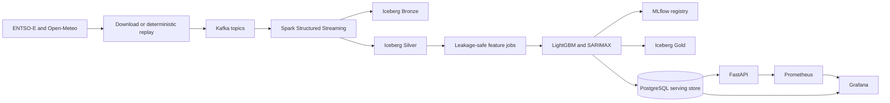

# Real-Time Energy Grid Intelligence Platform

This project is a locally reproducible reference platform for electricity demand and price forecasting in the Spanish ENTSO-E bidding zone. It demonstrates the awkward engineering cases that matter in an operational forecasting system: revisions, missing measurements, out-of-order events, DST delivery days, bounded backfills, model degradation, and rollback.

The default path uses committed fixtures and does not require external credentials. Live ENTSO-E and Open-Meteo connectors are included for controlled downloads.

For a step-by-step account of how the repository was built, the problems encountered, and instructions for obtaining an ENTSO-E API token, see [README_BUILD.md](README_BUILD.md).

## Architecture



Raw messages are always appended to Bronze. Silver uses deterministic business keys and revision-aware Iceberg `MERGE` operations. Events more than two hours late are isolated for bounded backfill instead of being silently discarded. Forecasts are materialized in PostgreSQL for predictable API latency and exported to Iceberg Gold for audit and analysis.

## Quick start

Requirements are Python 3.11, Docker with Compose, and at least 8 GB of memory available to Docker.

```bash
python -m venv .venv
.venv/Scripts/activate
python -m pip install -e ".[dev]"
pytest
docker compose up -d --build
docker compose run --rm demo
```

On Linux or macOS, activate the environment with `source .venv/bin/activate`.

The main interfaces are:

- FastAPI and OpenAPI: `http://localhost:8000/docs`
- Grafana: `http://localhost:3000`, using `admin` / `energy` for local administration
- MLflow: `http://localhost:5000`
- Prometheus: `http://localhost:9090`
- MinIO console: `http://localhost:9001`, using `minio` / `minio123`

Start the optional Spark/Iceberg consumer with:

```bash
docker compose --profile streaming up -d spark-streaming
docker compose run --rm demo
```

The demo expands a deterministic scenario into model-training data, trains LightGBM P10/P50/P90 models, publishes fixture events with injected duplicates, gaps, late arrivals, and malformed messages, and writes demand and price forecasts to PostgreSQL.

## Forecast products and API

Demand forecasts contain 24 quarter-hour steps over the next six hours. Price forecasts cover the next Spanish delivery day, which may contain 92, 96, or 100 intervals because of daylight-saving transitions.

```bash
curl http://localhost:8000/v1/forecasts/demand?horizon_hours=6
curl "http://localhost:8000/v1/forecasts/prices/day-ahead?delivery_date=2026-08-07"
curl http://localhost:8000/v1/models/status
curl http://localhost:8000/metrics
```

Every forecast includes its issue time, validity interval, point estimate, P10/P50/P90 values, model version, Iceberg snapshot reference, and quality flags. Responses also expose forecast age and staleness.

## Data contracts and failure handling

Canonical events use timezone-aware timestamps and preserve event time, publication time, and ingestion time. Feature construction uses publication-time as-of joins so a training row cannot see information that was unavailable at its forecast origin.

The fixture replayer accepts deterministic rates for duplicates, omissions, late arrivals, malformed events, and playback speed. Invalid events go to the dead-letter topic and Iceberg table. Late valid revisions go to `local.silver.late_events`.

Run a bounded Spark backfill with:

```bash
spark-submit src/energy_grid/backfill_job.py \
  --source entsoe \
  --start 2025-01-01T00:00:00Z \
  --end 2025-01-02T00:00:00Z
```

The backfill run ID is derived from the source and time bounds. A completed manifest prevents the same correction from being applied twice and records the before and after Iceberg snapshot IDs.

## Model lifecycle

The forecasting module contains global-horizon LightGBM quantile models, a SARIMAX statistical benchmark, seasonal persistence fallback behavior, forecast metrics, and promotion and rollback gates. A challenger must improve the primary metric by at least 2 percent without regressing a critical slice by more than 10 percent. The rollback controller requires three consecutive seven-day error breaches above 120 percent of the reference model before moving the MLflow `champion` alias back.

Production training runs should log the Git commit, feature schema hash, Iceberg snapshot, source versions, training window, overall metrics, and unusual-period slice metrics to MLflow. The committed demo marks fixture-derived forecasts explicitly and must not be presented as a real market forecast.

## Live data

Copy `.env.example` to `.env` and set `ENTSOE_TOKEN`. Credentials must remain outside source control.

The ENTSO-E connector supports actual demand, generation by type, and day-ahead price documents. The Open-Meteo connector calculates fixed population-weighted weather features for Madrid, Barcelona, Valencia, Seville, and Bilbao. Historical forecast data should be used for training; observed or reanalysis weather is suitable for monitoring but can introduce training-serving leakage if used as the model input.

## AWS deployment path

The Terraform configuration under `infra/terraform` provisions encrypted S3 storage, an AWS Glue catalog, MSK Serverless, EMR Serverless, RDS PostgreSQL, ECR repositories, an ECS cluster, HTTPS-only optional API service, Secrets Manager, GitHub OIDC, CloudWatch logs, and a monthly cost budget.

```bash
cd infra/terraform
cp terraform.tfvars.example terraform.tfvars
terraform init
terraform plan
```

The default plan creates shared infrastructure but no public API task. Set both `api_image` and `certificate_arn` to enable the HTTPS service. Protect Terraform state because it contains sensitive generated values. Before production use, add a remote encrypted state backend, private-subnet egress, API authentication, WAF rules, explicit retention policies, restore tests, and IAM-authenticated MSK client configuration.

GitHub Actions separates CI from deployment. CI runs linting, typing, tests, dependency audit, image builds, Terraform validation, and security scanning. Deployment is manual, uses GitHub OIDC rather than static AWS keys, and deploys an immutable Git SHA image.

## Operational boundaries

This platform is advisory. It does not place market orders or issue grid-control instructions. Source terms, redistribution rights, and rate limits must be reviewed before publishing downloaded data. Local passwords are intentionally development-only and must be replaced through the AWS secret path before any external exposure.
