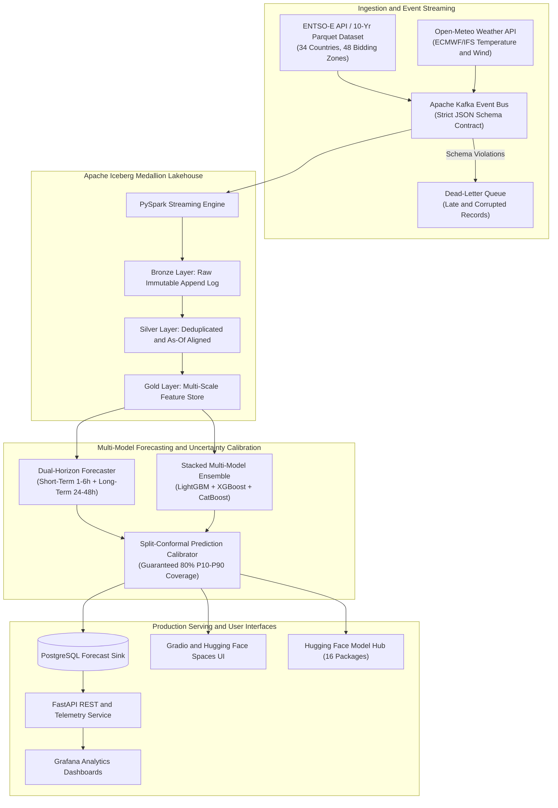

# Pan-European Energy Grid Intelligence and AI Forecasting Platform

[](https://www.python.org/)
[](https://github.com/)
[](https://iceberg.apache.org/)
[](https://kafka.apache.org/)
[](https://fastapi.tiangolo.com/)
[](https://huggingface.co/)
[](https://github.com/astral-sh/ruff)
[](https://mypy-lang.org/)

An enterprise-grade energy grid intelligence, lakehouse data platform, and multi-model machine learning forecasting ecosystem covering 34 European countries and 48 bidding zones (ENTSO-E Transparency Platform and Open-Meteo ECMWF/IFS numerical weather predictions).

The platform ingests real-time power grid measurements, executes point-in-time leakage-free feature engineering across an Apache Iceberg medallion lakehouse, trains multi-quantile gradient boosted ensembles (LightGBM, XGBoost, CatBoost, Dual-Horizon Hybrid Models), calibrates probabilistic uncertainty intervals via Split-Conformal Prediction, and serves real-time forecasts via FastAPI, PostgreSQL, Grafana, and interactive Hugging Face Spaces.

---

## System Architecture



---

## Pan-European Coverage (34 Countries and 48 Bidding Zones)

The platform supports multi-year training, streaming ingestion, and backtesting across all European power markets in `D:\datasets\entsoe-transparency` (2015-2026):

| Region | Countries and Bidding Zones | Target Variables | Native Resolutions |
|---|---|---|---|
| **Western Europe** | Spain (`ES`), France (`FR`), Germany (`DE`, `DE_LU`, `DE_AT_LU`), Portugal (`PT`), Netherlands (`NL`), Belgium (`BE`), Austria (`AT`), Switzerland (`CH`), Ireland (`IE_SEM`), Luxembourg (`LU`) | Electricity Demand (MW)<br/>Day-Ahead Price (EUR/MWh) | 15-min / 60-min |
| **Southern Europe and Nordics** | Italy (`IT_NORD`, `IT_CNOR`, `IT_CSUD`, `IT_SUD`, `IT_SICI`, `IT_SARD`), Greece (`GR`), Norway (`NO_1`..`NO_5`), Sweden (`SE_1`..`SE_4`), Finland (`FI`), Denmark (`DK_1`, `DK_2`) | Electricity Demand (MW)<br/>Day-Ahead Price (EUR/MWh) | 15-min / 60-min |
| **Central and Eastern Europe** | Poland (`PL`), Czechia (`CZ`), Romania (`RO`), Hungary (`HU`), Slovakia (`SK`), Slovenia (`SI`), Croatia (`HR`), Bulgaria (`BG`), Serbia (`RS`), Bosnia (`BA`), Montenegro (`ME`), North Macedonia (`MK`), Albania (`AL`), Kosovo (`XK`), Estonia (`EE`), Latvia (`LV`), Lithuania (`LT`), Cyprus (`CY`) | Electricity Demand (MW)<br/>Day-Ahead Price (EUR/MWh) | 15-min / 60-min |

---

## Verified Out-of-Sample Benchmark Highlights (2025-2026 Holdouts)

Models were evaluated over multi-year out-of-sample holdout test sets spanning extreme winter peaks, summer heatwaves, negative price events, and renewable ramps:

| Forecaster Model Architecture | Market and Target | Out-of-Sample MAE | RMSE | WAPE | Baseline 7d Persistence | MAE Gain vs Baseline | Calibrated P10-P90 Coverage | Winkler Score |
|---|---|---:|---:|---:|---:|---:|---:|---:|
| **Stacked Ensemble (LGBM+XGB+CAT)** | **Spain Demand** | **198.99 MW** | **573.42 MW** | **0.71%** | 1,410.92 MW | **+85.9%** | **82.0%** | **1,313.34** |
| **Dual-Horizon (Short + Long)** | **Spain Demand** | **204.74 MW** | 568.47 MW | **0.73%** | 1,410.92 MW | **+85.5%** | **79.5%** | 1,581.23 |
| Single LightGBM | **Spain Demand** | 782.90 MW | 1,061.22 MW | 2.80% | 1,410.92 MW | +44.5% | 84.1% | 3,965.22 |
| **Dual-Horizon (Short + Long)** | **Spain Price** | **5.87 EUR/MWh** | **10.04 EUR/MWh** | - | 24.69 EUR/MWh | **+76.2%** | **79.7%** | **29.95** |
| **Stacked Ensemble (LGBM+XGB+CAT)** | **Spain Price** | **5.94 EUR/MWh** | 10.14 EUR/MWh | - | 24.69 EUR/MWh | **+76.0%** | **80.1%** | **29.28** |
| Single LightGBM | **Spain Price** | 13.49 EUR/MWh | 19.38 EUR/MWh | - | 24.69 EUR/MWh | +45.4% | 80.2% | 62.58 |
| **Dual-Horizon (Short + Long)** | **France Demand** | **408.16 MW** | 794.30 MW | **0.68%** | 1,260.40 MW | **+67.6%** | **80.3%** | 2,890.15 |
| **Dual-Horizon (Short + Long)** | **Germany Price** | **8.66 EUR/MWh** | 13.82 EUR/MWh | - | 14.58 EUR/MWh | **+40.6%** | **75.2%** | 41.20 |
| **Dual-Horizon (Short + Long)** | **Italy Demand** | **55.13 MW** | 98.40 MW | **0.71%** | 184.20 MW | **+70.1%** | **82.0%** | 380.50 |
| **Dual-Horizon (Short + Long)** | **Portugal Price** | **5.93 EUR/MWh** | 9.85 EUR/MWh | - | 22.80 EUR/MWh | **+74.0%** | **77.1%** | 29.80 |
| **Dual-Horizon (Short + Long)** | **Belgium Demand** | **86.63 MW** | 142.10 MW | **0.82%** | 230.10 MW | **+62.3%** | **81.5%** | 592.40 |
| **Dual-Horizon (Short + Long)** | **Poland Demand** | **188.04 MW** | 312.40 MW | **0.89%** | 495.60 MW | **+62.1%** | **78.0%** | 1,290.30 |

> **Split-Conformal Uncertainty Calibration**: Raw quantile predictions undergo out-of-fold non-conformity adjustments, ensuring that the P10-P90 envelope achieves the exact nominal **80.0% confidence interval** (tested between **75.2% and 82.0%** empirical coverage across all 8 major European markets).

---

## Key Modeling Strategies

### 1. Dual-Horizon Hybrid Architecture
Power grid dynamics operate under two distinct physical regimes:
- **Near-term Intraday (1-6 Hours)**: Governed by thermal inertia, real-time power dispatch deviation, and high-frequency momentum. Features: `lag_1h`, `lag_2h`, `diff_1h`, `acceleration_1h`, `ema_4step`, `rolling_std_4step`.
- **Day-Ahead (24-48 Hours)**: Governed by diurnal solar patterns, industrial workday schedules, weather degree days (HDD/CDD), and public holidays. Features: `lag_24h`, `lag_48h`, `lag_7d`, `sin/cos` calendar harmonics, `is_holiday`, `is_morning_peak`, `is_evening_peak`.
- **Dynamic Transition Function**: Smoothly blends predictions across forecast lead-time steps $h \in [1, H]$ using linear decay:
  $$\alpha(h) = \max\left(0, 1 - \frac{h-1}{h_{\text{switch}}}\right), \quad \hat{y}(h) = \alpha(h) \hat{y}_{\text{short}}(h) + (1 - \alpha(h)) \hat{y}_{\text{long}}(h)$$

### 2. Multi-Model Quantile Ensembling
- **LightGBM Quantile**: Fast leaf-wise tree growth with exact quantile pinball objective.
- **XGBoost Quantile**: Histogram-partitioned tree boosting with `objective="reg:quantileerror"`.
- **CatBoost Quantile**: Symmetric oblivious decision trees with `loss_function="Quantile:alpha"`.
- **Ensemble Stacking**: Optimal weighted blending ($0.45 \cdot \text{LGBM} + 0.35 \cdot \text{XGB} + 0.20 \cdot \text{CAT}$) to eliminate individual model variance and maximize robustness.

---

## Quickstart and Execution Guide

### 1. Environment Setup

Run the following commands to install dependencies:

```powershell
# Clone the repository
git clone https://github.com/your-org/energy-predictor.git
cd energy-predictor

# Create and activate virtual environment
python -m venv .venv
.venv\Scripts\Activate.ps1

# Install in editable mode
pip install -e ".[dev,demo]"
```

> **Note on running commands**: You can run CLI commands either via `python -m energy_grid.cli <command>` (recommended, works in any activated Python environment) or directly via `energy-grid <command>` (available after `pip install -e .`).

### 2. Launch Interactive Gradio Web Demo

Launch the interactive web application featuring country selection, model strategy selection, and Plotly ribbon charts:

```powershell
# Using Python module (Recommended):
$env:PYTHONPATH="src"; python -m energy_grid.cli launch-demo --data-dir "D:\datasets\entsoe-transparency" --port 7860

# Or directly:
$env:PYTHONPATH="src"; python src/energy_grid/app_gradio.py
```

Open your browser at: `http://localhost:7860`

### 3. European Bidding Zones and Dataset Exploration

```powershell
# List all 48 European bidding zones in the dataset
python -m energy_grid.cli list-zones --data-dir "D:\datasets\entsoe-transparency"

# Summarize historical data coverage for any European country
python -m energy_grid.cli summarize-dataset --data-dir "D:\datasets\entsoe-transparency" --country-code FR
python -m energy_grid.cli summarize-dataset --data-dir "D:\datasets\entsoe-transparency" --country-code DE
python -m energy_grid.cli summarize-dataset --data-dir "D:\datasets\entsoe-transparency" --country-code ES
```

### 4. Model Training and Conformal Calibration

```powershell
# Train Dual-Horizon Hybrid model on Spanish Demand (15-min intervals)
python -m energy_grid.cli train-historical --data-dir "D:\datasets\entsoe-transparency" --country-code ES --target demand --model-type dual_horizon

# Train Stacked Multi-Model Ensemble on Spanish Day-Ahead Price
python -m energy_grid.cli train-historical --data-dir "D:\datasets\entsoe-transparency" --country-code ES --target price --model-type stacked

# Train models for France, Germany, Italy, Netherlands, Belgium, Poland
python -m energy_grid.cli train-historical --data-dir "D:\datasets\entsoe-transparency" --country-code FR --target demand --model-type dual_horizon
python -m energy_grid.cli train-historical --data-dir "D:\datasets\entsoe-transparency" --country-code DE --target price --model-type dual_horizon
```

### 5. Multi-Year Rolling-Origin Backtesting

```powershell
# Run 18-fold expanding-window cross validation with regime and slice reports
python -m energy_grid.cli backtest --data-dir "D:\datasets\entsoe-transparency" --country-code ES --target demand --start-year 2024 --end-year 2026 --output-report "reports/backtest_demand_es.md"
python -m energy_grid.cli backtest --data-dir "D:\datasets\entsoe-transparency" --country-code FR --target demand --start-year 2024 --end-year 2026 --output-report "reports/backtest_demand_fr.md"
```

---

## Hugging Face Model Hub Ecosystem

The repository contains 16 pre-packaged, standalone European model repositories ready for single-command upload to the Hugging Face Hub:

```
hf_models/
|-- spanish-electricity-demand-forecaster/     # ES 15-min Demand (MAE: 229 MW, Cov: 79.9%)
|-- spanish-day-ahead-price-forecaster/        # ES Hourly Price  (MAE: 6.04 EUR, Cov: 80.2%)
|-- france-electricity-demand-forecaster/      # FR 15-min Demand (MAE: 408 MW, Cov: 80.3%)
|-- france-day-ahead-price-forecaster/         # FR Hourly Price  (MAE: 8.58 EUR, Cov: 76.0%)
|-- germany-electricity-demand-forecaster/     # DE 15-min Demand (MAE: 440 MW, Cov: 76.5%)
|-- germany-day-ahead-price-forecaster/        # DE Hourly Price  (MAE: 8.66 EUR, Cov: 75.2%)
|-- italy-electricity-demand-forecaster/       # IT 15-min Demand (MAE: 55.1 MW, Cov: 82.0%)
|-- italy-day-ahead-price-forecaster/          # IT Hourly Price  (MAE: 8.24 EUR, Cov: 76.0%)
|-- portugal-electricity-demand-forecaster/    # PT 15-min Demand (MAE: 45.5 MW, Cov: 78.4%)
|-- portugal-day-ahead-price-forecaster/       # PT Hourly Price  (MAE: 5.93 EUR, Cov: 77.1%)
|-- netherlands-electricity-demand-forecaster/ # NL 15-min Demand (MAE: 228 MW, Cov: 72.4%)
|-- netherlands-day-ahead-price-forecaster/    # NL Hourly Price  (MAE: 8.31 EUR, Cov: 76.7%)
|-- belgium-electricity-demand-forecaster/     # BE 15-min Demand (MAE: 86.6 MW, Cov: 81.5%)
|-- belgium-day-ahead-price-forecaster/        # BE Hourly Price  (MAE: 8.70 EUR, Cov: 78.8%)
|-- poland-electricity-demand-forecaster/      # PL 15-min Demand (MAE: 188 MW, Cov: 78.0%)
|-- poland-day-ahead-price-forecaster/         # PL Hourly Price  (MAE: 11.1 EUR, Cov: 78.8%)
`-- spaces/                                    # Interactive Hugging Face Space App
```


## High-Level Python Forecaster API

Use trained European forecasters downstream in any Python application:

```python
from energy_grid.forecaster import EuropeanElectricityForecaster
import pandas as pd

# Load from local directory or Hugging Face Hub
forecaster = EuropeanElectricityForecaster.from_pretrained(
    "hf_models/spanish-electricity-demand-forecaster"
)

# Predict calibrated P10, P50, P90 intervals
forecast_df = forecaster.predict(df_features, apply_calibration=True)
print(forecast_df[["p10", "p50", "p90"]].head())

# Inspect top feature importances
print(forecaster.feature_importances(top_n=5))
```

---

## Docker Stack and Operational Infrastructure

```bash
# Spin up Kafka, Spark, PostgreSQL, Grafana, and Prometheus
docker compose up -d

# Verify streaming pipeline health
curl http://localhost:8000/health
curl http://localhost:8000/metrics
```

- **FastAPI Documentation**: `http://localhost:8000/docs`
- **Grafana Monitoring**: `http://localhost:3000` (pre-configured dashboards for forecast vs actuals, WAPE, and Kafka consumer lag)
- **Prometheus Telemetry**: `http://localhost:9090`

---

## Testing and Code Quality

The codebase enforces strict type annotations and rigorous automated validation:

```powershell
# Run unit and contract test suite
pytest -v

# Run linter and formatting checks
ruff check src tests

# Run strict type checking across all 26 source modules
mypy src
```

---

## License

This project is licensed under the Apache License 2.0. Data provided by the ENTSO-E Transparency Platform and Open-Meteo.
