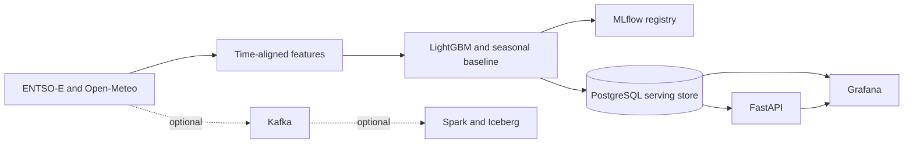

# Real-Time Energy Grid Intelligence Platform

This project downloads real Spanish electricity data from ENTSO-E, combines it with Open-Meteo weather forecasts, trains LightGBM demand and price models, and serves the resulting forecasts through FastAPI and Grafana. A valid `ENTSOE_TOKEN` is required for the real-data run.

The normal local path is deliberately small: ENTSO-E/Open-Meteo, a training job, PostgreSQL, MLflow, FastAPI, and Grafana. Kafka, Spark, and Iceberg remain available as an advanced, experimental streaming demonstration; they are not required to obtain or view real forecasts.

For a step-by-step account of how the repository was built, the problems encountered, and instructions for obtaining an ENTSO-E API token, see [README_BUILD.md](README_BUILD.md).

For an honest assessment of the current model quality, verified metrics, limitations, and promotion requirements, see [MODEL_CARD.md](MODEL_CARD.md). Real source data does not imply production-quality predictions.

## Architecture



The real-data job records source checksums and creates leakage-aware lag and weather features. Forecasts are materialized in PostgreSQL for predictable API latency. When the optional streaming profile is enabled, raw messages are also appended to Iceberg Bronze and processed into revision-aware Silver tables.

## Quick start

Requirements are Docker Desktop with Linux containers and Docker Compose. Python does not need to be installed on the host for the normal run.

```powershell
Copy-Item .env.example .env
# Edit .env and set ENTSOE_TOKEN, then run:
docker compose up -d --build
docker compose run --rm live-demo
```

The second command downloads approximately 45 days of actual Spanish demand and day-ahead prices, downloads matching weather forecast data, trains demand and price models, stores 24 demand forecasts and the next Spanish delivery day's price intervals, and logs both runs in MLflow. It normally takes a few minutes. Re-running it refreshes the forecasts with current source data.

The main interfaces are:

- FastAPI and OpenAPI: `http://localhost:8000/docs`
- Grafana: `http://localhost:3000`, using `admin` / `energy` for local administration
- MLflow: `http://localhost:5000`
- Prometheus: `http://localhost:9090`
- MinIO console: `http://localhost:9001`, using `minio` / `minio123`

Open Grafana after `live-demo` finishes. The demand and price panels select only the newest forecast issue time, so old fixture or previous-run records do not obscure the current real result. The API response quality flags contain `real_source_data`, `entsoe_actuals`, and `open_meteo_historical_forecast`.

For a shorter real-data run, 15 days is the supported minimum:

```powershell
docker compose run --rm live-demo python -m energy_grid.cli live-demo --history-days 15 --no-publish-kafka
```

To experiment with the advanced Kafka/Spark/Iceberg path:

```powershell
docker compose --profile streaming up -d kafka kafka-init kafka-exporter spark-streaming
docker compose run --rm live-demo python -m energy_grid.cli live-demo --publish-kafka
```

The committed fixture scenario remains available for offline tests and deliberate failure injection:

```powershell
docker compose --profile demo --profile streaming run --rm demo
```

## Forecast products and API

Demand forecasts contain 24 quarter-hour steps over the next six hours. Price forecasts cover the next Spanish delivery day, which may contain 92, 96, or 100 intervals because of daylight-saving transitions.

```bash
curl http://localhost:8000/v1/forecasts/demand?horizon_hours=6
curl http://localhost:8000/v1/models/status
curl http://localhost:8000/metrics
```

Use `http://localhost:8000/docs` to call the day-ahead price endpoint with the delivery date returned by the latest real-data run.

Every forecast includes its issue time, validity interval, point estimate, P10/P50/P90 values, model version, Iceberg snapshot reference, and quality flags. Responses also expose forecast age and staleness.

## Data contracts and failure handling

Canonical events use timezone-aware timestamps and preserve event time, publication time, and ingestion time. Feature construction uses publication-time as-of joins so a training row cannot see information that was unavailable at its forecast origin.

The fixture replayer accepts deterministic rates for duplicates, omissions, late arrivals, malformed events, and playback speed. Invalid events go to the dead-letter topic and Iceberg table. Late valid revisions go to `local.silver.late_events`.

Run a bounded Spark backfill with:

```bash
spark-submit src/energy_grid/backfill_job.py \
  --source entsoe \
  --start 2025-01-01T00:00:00Z \
  --end 2025-01-02T00:00:00Z
```

The backfill run ID is derived from the source and time bounds. A completed manifest prevents the same correction from being applied twice and records the before and after Iceberg snapshot IDs.

## Model lifecycle

The forecasting module contains global-horizon LightGBM quantile models, a SARIMAX statistical benchmark, seasonal persistence fallback behavior, forecast metrics, and promotion and rollback gates. A challenger must improve the primary metric by at least 2 percent without regressing a critical slice by more than 10 percent. The rollback controller requires three consecutive seven-day error breaches above 120 percent of the reference model before moving the MLflow `champion` alias back.

Production training runs should log the Git commit, feature schema hash, Iceberg snapshot, source versions, training window, overall metrics, and unusual-period slice metrics to MLflow. The committed demo marks fixture-derived forecasts explicitly and must not be presented as a real market forecast.

The current real-data models are portfolio MVP candidates, not validated champions. The verified run used only 605 demand training rows and 674 price training rows, followed by one holdout shorter than two days. Demand reached 2.75% WAPE, but P10-P90 coverage was only 34.4%; price MAE was 29.629 EUR/MWh and coverage was 45.8%. A nominal P10-P90 interval should approach 80% coverage over a representative evaluation sample. The API status `live` currently means “materialized from live-source data”, not “approved for production”.

See [MODEL_CARD.md](MODEL_CARD.md) before interpreting or presenting any forecast metric.

## Real-data inputs

Copy `.env.example` to `.env` and set `ENTSOE_TOKEN`. Credentials must remain outside source control.

The ENTSO-E connector retrieves actual demand, generation by type, and day-ahead price documents. Price requests specify Spain as both the input and output domain, as required by the ENTSO-E API. The Open-Meteo connector calculates fixed population-weighted weather features for Madrid, Barcelona, Valencia, Seville, and Bilbao. Historical forecast data is used for training so its information set matches the live forecast interface.

The token is sent only as the ENTSO-E request parameter. It is excluded from stored request metadata, error messages, model tags, and source manifests. Do not publish `.env` or the output of `docker inspect`, because container environment variables are visible there.

## AWS deployment path

The Terraform configuration under `infra/terraform` provisions encrypted S3 storage, an AWS Glue catalog, MSK Serverless, EMR Serverless, RDS PostgreSQL, ECR repositories, an ECS cluster, HTTPS-only optional API service, Secrets Manager, GitHub OIDC, CloudWatch logs, and a monthly cost budget.

```bash
cd infra/terraform
cp terraform.tfvars.example terraform.tfvars
terraform init
terraform plan
```

The default plan creates shared infrastructure but no public API task. Set both `api_image` and `certificate_arn` to enable the HTTPS service. Protect Terraform state because it contains sensitive generated values. Before production use, add a remote encrypted state backend, private-subnet egress, API authentication, WAF rules, explicit retention policies, restore tests, and IAM-authenticated MSK client configuration.

GitHub Actions separates CI from deployment. CI runs linting, typing, tests, dependency audit, image builds, Terraform validation, and security scanning. Deployment is manual, uses GitHub OIDC rather than static AWS keys, and deploys an immutable Git SHA image.

## Operational boundaries

This platform is advisory. It does not place market orders or issue grid-control instructions. Source terms, redistribution rights, and rate limits must be reviewed before publishing downloaded data. Local passwords are intentionally development-only and must be replaced through the AWS secret path before any external exposure.
